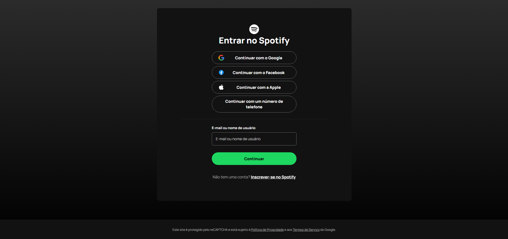

# 🎧 Spotify Auth Interface – v1.0

Tela de login inspirada no Spotify, desenvolvida com **HTML5** e **CSS3**, focando em estrutura semântica, layout fluido e boas práticas de código.  
Este projeto é parte de um processo de evolução técnica como desenvolvedor front-end.

---

## 🧩 Tecnologias utilizadas

- HTML5 semântico
- CSS3 com Flexbox e unidades fluidas (`%`, `rem`, `max-width`)
- Google Fonts (Manrope, Poppins, Lato)
- Ícones vetoriais (SVG)
- Favicon customizado
- Organização com comentários e classes estruturadas

---

## 📐 O que foi entregue na versão 1.0

- Estrutura completa da tela de login
- Layout visual fiel ao Spotify
- Flexbox centralizado
- Estilo fluido e responsivo na largura
- Hover e transições suaves em botões
- Conversão de tamanhos para `rem` nos principais textos
- Padrão visual consistente

> **Observação:** Essa versão é apenas visual. Funcionalidades como validação, cadastro e login serão implementadas nas próximas etapas.

---

## 🖼️ Print da interface

---

## 🌐 Deploy

Acesse a versão online pelo GitHub Pages:  
🔗 **[Spotify Auth Interface – v1.0](https://avilaleo.github.io/spotify-auth-interface)**

---

## 🚀 Próximas versões

- **v1.1:** Responsividade mobile-first
- **v1.2:** Cadastro multi-etapas com localStorage
- **v1.3:** Validações em tempo real
- **v1.4:** Login funcional
- **v2.0:** Design Tokens e acessibilidade
- **v3.0:** Integração com API Fake (JSON Server)

---

## 🙋‍♂️ Sobre mim

Me chamo **Leonardo Prado Ávila**, sou desenvolvedor em formação, cursando pós-graduação em Full Stack Development. Esse projeto é parte da minha construção de portfólio e também do meu processo de evolução como desenvolvedor.  

---
